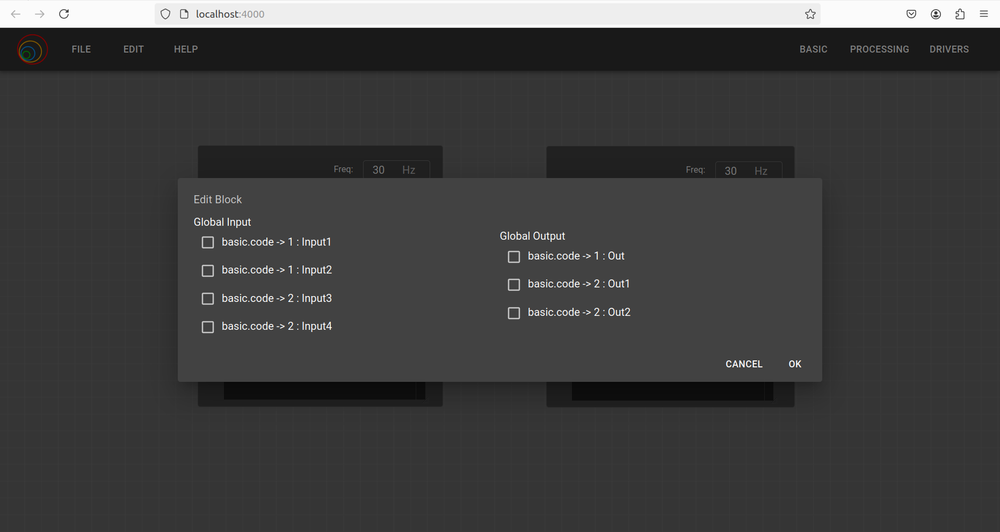

On the 10th of June, during Monday's meeting, Dr. JoseMaria explained the Global Input Output issue. Whenever the user creates a Robotics Application circuit, if it needs to generate a block, the user needs to modify the circuit, which is very time-consuming. Therefore, we need to implement the functionality for generating both the block and the circuit without modifying the circuit. This functionality will improve user performance on VC. Additionally, the tasks from the previous week were only partially completed, so they have been reassigned for this week.
## Goals
- [ ] Modification of VC block compostion for Global Input Output [In Progress]
- [ ] Create first global test workflow [In Progress]
- [ ] Solve the issue of nested block [In Progress]

## Accomplishment and Challenges

* #### Understanding the VC Block Composition
I went through some frontend files such as `menu/index.tsx`, `project-info-dialog.tsx`, and `editor.ts`. These files are responsible for editing the project information on the frontend side. Initially, I thought of adding Global Input Output functionality within the existing project editing interface. However, as I began implementing it, I realized that it was more difficult than anticipated since it required changing the Project Info interface in every file. Therefore, I decided to build a new dialog box that can be opened from the "Save Block" option in the menu bar.

* #### Implementation of Global Input Output on frontend
For choosing the Global Input Output, all inputs and outputs can be shown, and from there, the Global Input Output can be assigned. I created a new script for the dialog box and modified `editor.ts` and `menu/index.tsx`. Currently, all inputs and outputs are displayed. Next week, I will work on assigning the inputs and outputs as Global for the block.

Checkbox for global input output - dialog box:

* #### Solving the nested block with different approach
In this approach, I didn't use `node.dependencies` but instead created blocks and wires for internal dependencies. This solution was suggested by ChatGPT, so I tried it. It involved creating internal wires for dependencies and making the linkages. I spent around two days on this, but it didn't yield the desired results. Additionally, it was suggesting editing many internal components, so I dropped this idea and returned to my nested block solution.

* #### Solving the nested block with last week approach
In the previous week, I encountered blank dependencies. I noticed that the interface dependencies contained a single dependency, so I modified it to include an array and used recursive calls to add internal dependencies. Additionally, `factory.tsx` had not been changed, so I modified that as well. However, the issue of blank dependencies still persists. I need to consult the mentors regarding this issue, as I feel it can be resolved with some more effort.

## Previous PR Updates
1. Merged - [https://github.com/JdeRobot/VisualCircuit-resources/pull/12](https://github.com/JdeRobot/VisualCircuit-resources/pull/12)
