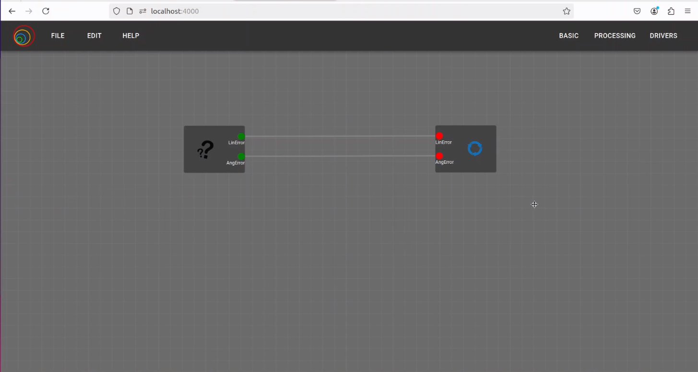
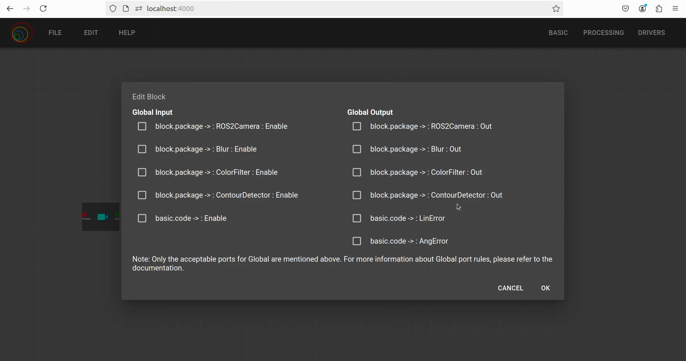

In the past two weeks, the main task has been to complete the remaining demo and resolve issues that arose along the way. A major issue was with the FSM circuit, where there were multiple inputs and outputs connected to a single port. This issue has been partially resolved; when the number of inputs and outputs is equal, the wires are mapped correctly, but if they are unequal, the issue persists. Another issue was with IDs remaining the same across multiple instances of the same block. This has been resolved using a queue (detailed in the "Achievements and Challenges" section). Additionally, there was a problem where, after pressing the Back button, the model data remained the same, leading to identical IDs for multiple instances. By the end of week 12, the line follower with the composed block feature was successfully solved.

## Goals
- [x] Multiple instances of block issue
- [x] Line follower with composed block feature
- [ ] Partially resolved the single port with multiple input/output issue
- [x] Completed Python file for CI workflow build test

## Sub-Goals
- [x]  Solved the line follower with a single level
- [x]  Resolved the single port with multiple input/output issue when the number of inputs and outputs is the same
- [x]  Resolved the issue of identical IDs across multiple instances of the same block
- [x]  Resolved the issue of model data remaining the same when the Back button is pressed
- [x]  Solved the line follower with composed block feature
- [x]  Completed the Python file for the CI workflow

## Images
Composed circuit of line follower:

Internal perception composed block:

Global Input Output dialog box:

## Accomplishment and Challenges

* #### Identical IDs across multiple instances of the same block
In the line follower demo, Dr. Jose Maria suggested using two generic PID blocks, which led to the issue of identical IDs across multiple instances. While the line follower worked with a single PID, using two PID instances is more appropriate as it minimizes errors in linear and angular velocities. The issue arose because multiple levels were converted into a single level after backend processing, resulting in identical IDs for both internal blocks, causing incorrect wire and block mapping. To resolve this, I added an extra script in the "Add as Block" function before the jsonModel.design is appended. This script iterates to modify the IDs with random IDs, and not only the block but also the design's wire and layer block IDs need to be changed, which was achieved in this extra script.

* #### Issue with model data remaining unchanged when the Back button is pressed
After solving the issue with identical IDs across multiple instances, another issue arose where, upon entering a package, the ID and internal data of the block remained the same as they were at the time of importing. This issue was due to the node layers in the editor, as the model of the editor was appended in the higher-level block stack. The code I wrote to solve the multiple instance issue involved modifying the IDs of the design model. To fix this, I added an extra iteration in the loadPackage function. In the editor, there were two objects—one for links and one for blocks—so both IDs needed to be changed along with the earlier design IDs.

* #### Single port with multiple input/output issue
This issue occurred when David's FSM circuit was created using the composed block feature. In David's circuit, multiple blocks were attached to a single port. My approach was to use a queue operation to map all blocks, but there were many cases where the number of inputs and outputs was not the same, requiring the creation of extra links. The issue with equal numbers of input/output blocks was resolved using the queue approach.

